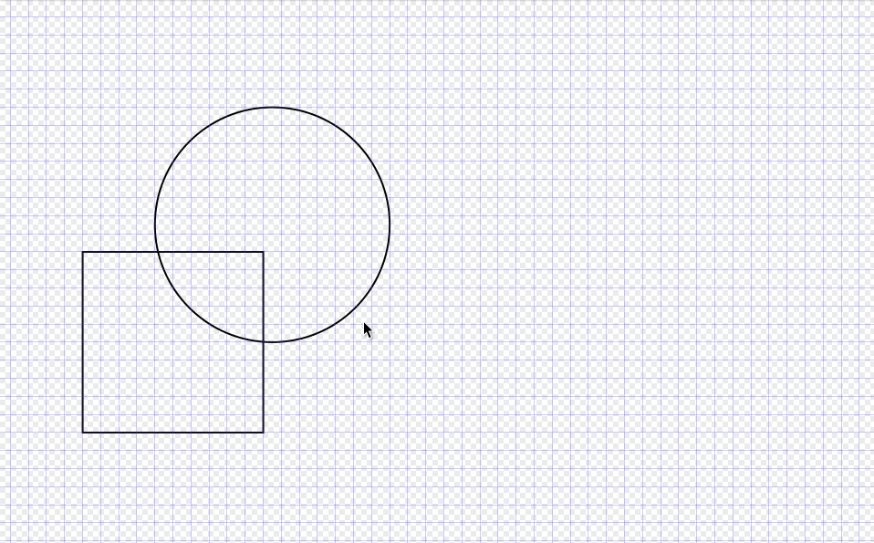
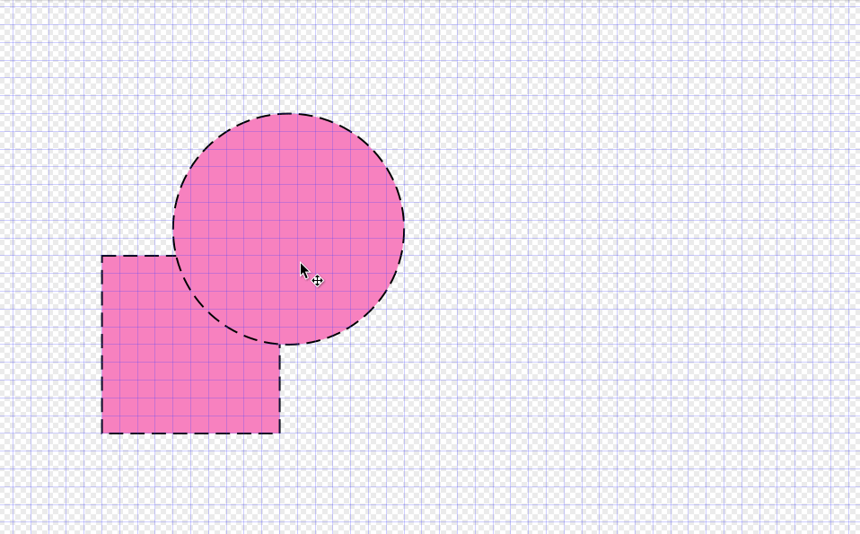

# InkStyle

A toy program that manages the styles and applies them to [Inkscape](https://inkscape.org).

Inspired by [inkscape-shortcut-manager](https://github.com/gillescastel/inkscape-shortcut-manager).

Runtime dependencies: Qt5

## Why

To save a few clicks/presses.

## How

### Apply styles

The main panel is invoked by a configurable shortcut. By default it's `Ctrl+Shift+F`.

* To apply a single style, press and hold the shortcut. Move the cursor on one of the buttons, then release the shortcut.
* To compose different styles, click different buttons while holding the shortcut. The composed styles will be displayed at the center.

<div style="width:80%;margin:auto">



</div>


### Save styles

To save the style, first copy the node/element from Inkscape (`Ctrl+Shift+C`). Then open the main panel by pressing and holding the shortcut, and right-click-hold on any buttons to which you'd like to save the style.

<div style="width:80%;margin:auto">



</div>

The style will be stored on a generated config file and override (not overwrite) the preconfigured style. If the generated config file is deleted, the preconfigured style will be revealed again. (see [Configure file](#configure-file))

### Apply LaTeX snippets

Requirement: an editor (vim by default)

Press another shortcut (by default `Ctrl+Shift+T`). Vim will pop up. Enter anything into it, then close vim. The entered content will be pasted to Inkscape.

<div style="width:80%;margin:auto">


</div>

### Apply rendered LaTeX snippets

Requirements:
* an edtor (vim by default)
* pdflatex
* pdf2svg

Press yet another shortcut (by default `Ctrl+Shift+Y`). Vim will pop up. enter anything into it, then close vim. The entered content will be compiled to pdf, converted to svg, and pasted to Inkscape.

<div style="width:80%;margin:auto">


</div>

### Configure file

There are three stacked configure files:
1. The default one (Embedded in the program).
2. `.config/inkstyle/config.yaml`: Can be edited, overrides 1.
3. `.config/inkstyle/config.generated.yaml`: Generated (by saving styles), overrides 2.

All config files are divided into 3 sections: `global`, `styles`, and `defs`, which store global configurations, styles to be applied, and [SVG defs](https://developer.mozilla.org/en-US/docs/Web/SVG/Element/defs) that can be reused by styles separately. The default config file is [res/default.yaml](res/default.yaml) (with comments explaining each entry).

### Tooltips

Move the cursor to the center, and you'll find the styles that'll be applied.

<div style="width:80%;margin:auto">


</div>


# Build / Debug

Build dependencies:
* CMake & C++ toolchain
* Qt5 (Qt6 not tested)
* cargo (to build resvg)

Dependent libraries (pugixml, QHotkey, resvg, yaml-cpp) are cloned as git sub-modules and automatically built as dependencies. They're statically linked when using Linux systems so there's no need to install them explicitly.

Build the project:
```bash
# 1. Clone this repo and all 3rd-party dependencies.
git clone https://github.com/husixu1/inkstyle
cd inkstyle
git submodule update --init

# 2. Build it
mkdir build
cd build
cmake .. -DCMAKE_BUILD_TYPE=Release

# For linux (gcc):
make -j16

# For windows (msvc. mingw doesn't work):
cmake --build . -j 16

# Or instead, build with Qt Creator
```

# License


